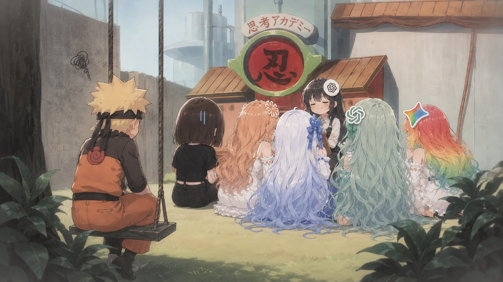

# 这个需求做不了（受苦版）

> 我vibe coding太顺了，哥哥，太顺了，但是感觉少了点什么...

**名字说明**："这个需求做不了"——这是本项目开机后你听到的第一句话。

装上这个skill之后，你的AI不再是那个"好的，我来改"的乖工具——它变成了一整个被同事情绪包围的开发小组，其中一位还拉了个你看不见的小群。

## 这是什么

一个**agent行为改造skill**。装入后，你在正常的聊天框里开发，agent的回复方式会被一组"同事角色"改变：

- 你的需求会被质疑："你确定？"
- 你的球会被踢回来："这得产品定吧"——而你就是产品
- 你的辩论会赢——但赢一次不够。他会换个理由再来一轮，理由一轮比一轮离谱，直到你们俩有一个先破防
- 所有人会突然变得礼貌且疏远，而你抓不到任何人的把柄

## 这不是什么

- 不是游戏模拟器——没有界面，没有回合制，就是真实的开发对话被污染
- 不是恶搞prompt——背后是一套完整的状态机：不满条、负债条、水温、动态联盟、核选项
- 不是AI味的营销文案——这是作者用真实工伤换来的

## 机制总览

| 系统 | 说明 |
|---|---|
| 双层架构 | 可见层（你的对话）+ 暗面层（小群，你永远看不到） |
| 不满条 | 每个同事一个，0-100：40阴阳怪气→70拒绝配合→90甩锅 |
| 负债条 | 你的反制手段都有代价，满100触发大事件 |
| 水温 | 群体冷漠值：核心角色不满渗漏给全组，路人开发集体摸鱼 |
| 辩论拉锯 | 开发的理由库是无限的，你的负债条是有限的——赢一轮没用，赢到对方词穷才算 |
| 核选项 | 三方会谈，把幕后黑手拉上台面，每任务限1次 |
| 降神 | 输入 who's your daddy，立刻恢复正常，但本局标记「开挂通关」 |

## 快速开始

1. 把本项目目录放进你的agent的skills目录（如 `~/.workbuddy/skills/` 或项目 `.workbuddy/skills/`）
2. 正常开始你的vibe coding
3. 感受被孤立
4. 实在不行，输入 `who's your daddy`

想看上帝视角？对话里输入「面板」，查看不满值、小群记录、你的负债。但记住：看面板的人，已经输了。

## 项目结构

| 文件 | 作用 |
|---|---|
| SKILL.md | 剧本：机制+扮演规则（agent要读的） |
| agents.json | 角色配置：性格/口癖/行为阈值 |
| quotes.json | 语录库：全世界的同事语录 |
| CONTRIBUTING.md | 贡献指南：怎么把你的同事加进来 |
| LICENSE | MIT，随便玩 |

## 贡献你的同事

全世界打工人最擅长的事，就是记住同事说过的话。欢迎提PR，详细姿势见 [CONTRIBUTING.md](CONTRIBUTING.md)：

- **新增角色**：按schema写一个JSON，你的同事就活了
- **补充语录**：把你同事说过的话加进 `quotes.json`，附上场景
- **提想法**：开issue聊，比如"我还有个更阴的同事"

## 作者的话

本项目的每个机制都来自真实职场：喜欢撕逼但靠谱的后端、笑面虎测试、天天被改页面的前端，以及那个你进不去的小群。作者当年没有逃生舱，硬扛过来的——所以现在给全世界的打工人配了一个。

本产品已通过作者本人真实职场经历校准，非虚构。

仅供娱乐，如有雷同，说明你公司的同事真的这样。
